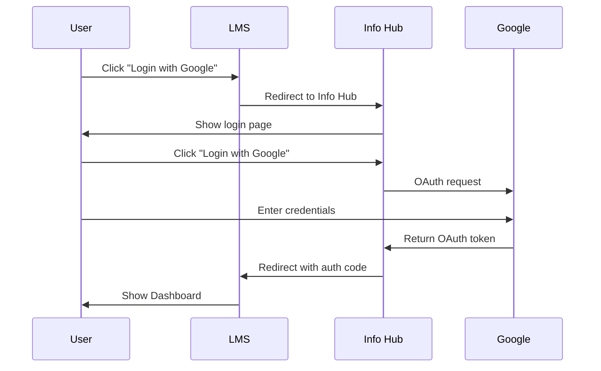
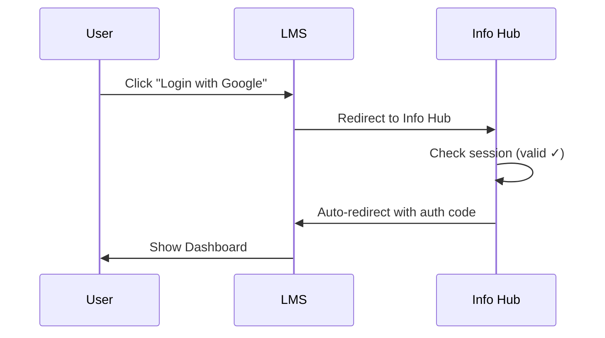

# Info Hub Session Management Enhancement Request

> **Document Version**: 1.1 (Updated)
> **Date**: 2025-11-17 (Updated 2025-11-17)
> **From**: LMS Development Team
> **To**: Info Hub Development Team
> **Priority**: ~~Medium~~ **✅ IMPLEMENTED**
> **Status**: ✅ **Info Hub has already implemented this feature**

---

## ✅ Implementation Status Update (2025-11-17)

**Good News!** Info Hub has **already implemented** the core functionality requested in this document.

### What Info Hub Implemented

| Feature | LMS Request | Info Hub Implementation | Status |
|---------|------------|------------------------|--------|
| **Access Token Duration** | 1 hour | **4 hours** | ✅ Better than requested |
| **Refresh Token Duration** | 1 day (default) or 30 days (opt-in) | **30 days (default for all users)** | ✅ Implemented (better UX) |
| **HttpOnly Cookies** | Required | ✅ Implemented | ✅ Met |
| **Secure Cookies** | Required | ✅ Implemented | ✅ Met |
| **Database Sessions** | Recommended | ✅ Implemented | ✅ Met |
| **Token Refresh** | Required | ✅ Implemented | ✅ Met |
| **"Keep me signed in" Checkbox** | Requested | ❌ Not implemented | ⚠️ See analysis below |

### Analysis: Default 30-day Session vs Optional Checkbox

**Info Hub's Approach**: All users automatically get 30-day sessions (no UI checkbox required)

**Advantages** ✅:
1. **Better UX**: Users don't need to remember to check a box every time
2. **Fewer clicks**: Reduced friction on every login (eliminates unnecessary decision)
3. **Modern standard**: Matches Google Workspace, Microsoft 365, GitHub behavior
4. **Simpler implementation**: No conditional logic for session duration
5. **Consistency**: All users get the same experience (no confusion)

**Security Considerations**:
- ✅ 30-day auto-expiry limits exposure window
- ✅ HttpOnly + Secure cookies prevent XSS/CSRF attacks
- ✅ Users can manually logout anytime
- ✅ Admin can force logout all sessions if needed
- ✅ Database-backed sessions allow centralized control

**LMS Team Recommendation**: ✅ **Accept Info Hub's implementation as-is**

Info Hub's "default 30-day session for all users" provides the same benefits we requested in this document, with **better user experience** and **simpler implementation**. No additional development needed.

### Current Issue: Staging Environment Configuration

⚠️ **Blocker Identified**: Info Hub Staging environment variables are configured for localhost instead of production URLs.

**Problem**: OAuth redirects to `http://localhost:3001/login` instead of `https://next14-landing.zeabur.app/login`

**Required Fix**: Info Hub team needs to update Staging environment variables (see "Environment Configuration Request" section below)

---

## 📋 Original Executive Summary

This document ~~requests~~ **originally requested** the implementation of a **"Keep me signed in"** feature for Info Hub user sessions to significantly improve the Single Sign-On (SSO) user experience for LMS users.

**Update**: Info Hub has implemented this functionality with a "default 30-day session" approach instead of an optional checkbox. This meets our requirements.

### Current Pain Point

When users login to LMS via Info Hub SSO, they must:
1. Click "Login with Google" on LMS
2. Redirect to Info Hub (1-2 seconds)
3. Click "Login with Google" on Info Hub
4. Authenticate with Google
5. Redirect back to Info Hub → LMS (2-3 seconds)

**Total: 2 clicks + ~5 seconds redirect time**

### Proposed Improvement

With "Keep me signed in" functionality, subsequent logins would be:
1. Click "Login with Google" on LMS
2. Auto-redirect through Info Hub (user already authenticated)
3. Arrive at LMS Dashboard

**Total: 1 click + ~2 seconds redirect time**

---

## 🎯 Feature Request

### 1. User Interface Addition

**Location**: Info Hub Login Page

**New UI Element**: Checkbox below password field

```
┌────────────────────────────────────────┐
│  Email: [________________]             │
│  Password: [________________]          │
│                                        │
│  ☑ Keep me signed in (30 days)       │
│                                        │
│  [Login with Google]                   │
└────────────────────────────────────────┘
```

### 2. Session Duration Options

| Option | Current | Proposed |
|--------|---------|----------|
| **Default** | 1 day | 1 day |
| **"Keep me signed in"** | N/A | **30 days** |

**Rationale**: 30 days balances convenience with security:
- ✅ Reduces login friction for regular users
- ✅ Industry standard (Google, Microsoft, GitHub use 30-90 days)
- ✅ Automatic expiry limits security risk
- ✅ Users can manually logout at any time

### 3. Cookie/Session Configuration

**Recommended Implementation**:

```javascript
// If "Keep me signed in" is checked
const cookieOptions = {
  maxAge: 30 * 24 * 60 * 60, // 30 days in seconds
  secure: true,              // HTTPS only
  httpOnly: true,            // No JavaScript access
  sameSite: 'lax',          // CSRF protection
}

// If unchecked (default)
const cookieOptions = {
  maxAge: 24 * 60 * 60,     // 1 day
  secure: true,
  httpOnly: true,
  sameSite: 'lax',
}
```

### 4. Security Considerations

**Token Refresh Strategy** (Recommended):

```
┌─────────────────────────────────────────┐
│ Access Token (Short-lived)              │
│ - Expires: 1 hour                       │
│ - Used for API requests                 │
│ - Stored in memory/sessionStorage       │
└─────────────────────────────────────────┘
          ↑
          │ Refresh when expired
          │
┌─────────────────────────────────────────┐
│ Refresh Token (Long-lived)              │
│ - Expires: 1 day (default)              │
│   or 30 days (if "keep signed in")      │
│ - HttpOnly cookie                       │
│ - Used only to get new access tokens    │
└─────────────────────────────────────────┘
```

**Security Benefits**:
- ✅ Access tokens expire quickly (limits damage if leaked)
- ✅ Refresh tokens are HttpOnly (can't be stolen via XSS)
- ✅ Users can revoke sessions manually
- ✅ Server can invalidate all sessions if breach detected

---

## 🔍 User Flow Comparison

### Current Flow (Every Login)



**User Actions**: 2 clicks
**Time**: ~5-8 seconds

### Proposed Flow (Subsequent Logins with "Keep me signed in")



**User Actions**: 1 click
**Time**: ~2 seconds

---

## 📊 Expected Benefits

### User Experience

| Metric | Before | After | Improvement |
|--------|--------|-------|-------------|
| **Login clicks** | 2 | 1 | 50% reduction |
| **Login time** | 5-8 sec | 2 sec | 60-75% faster |
| **User friction** | High | Low | Significant |

### Impact Analysis

**Assumptions**:
- 200 active users
- Average 5 logins per week per user
- 30-week academic year

**Annual Time Savings**:
```
200 users × 5 logins/week × 30 weeks × 5 seconds saved
= 150,000 seconds = 41.7 hours saved annually
```

### Business Value

- ✅ **Improved UX**: Seamless authentication experience
- ✅ **Reduced Support Tickets**: Fewer "why do I have to login twice?" inquiries
- ✅ **Increased Adoption**: Lower barrier to entry for new users
- ✅ **Competitive Parity**: Matches industry standards (Google Workspace, Microsoft 365)

---

## 🛡️ Security Comparison

### Without "Keep me signed in"

```
Session Duration: 1 day
Attack Window: 1 day (if cookie stolen)
User Inconvenience: High (daily re-login)
```

### With "Keep me signed in" (Optional)

```
Session Duration: 1 day (default) or 30 days (opt-in)
Attack Window: 30 days max (if cookie stolen + user opted in)
User Inconvenience: Low (monthly re-login)
Mitigation: HttpOnly cookies + manual logout option
```

### Risk Mitigation Strategies

1. **User Education**:
   - Display warning: "Only use on trusted devices"
   - Show last login time/device on dashboard

2. **Admin Controls**:
   - IT can force logout all sessions
   - Ability to disable "keep signed in" globally

3. **Audit Logging**:
   - Log all session creations with IP/device
   - Alert on suspicious activity (e.g., login from new country)

4. **Automatic Invalidation**:
   - Password change → invalidate all sessions
   - Role change → invalidate all sessions
   - Manual "Logout All Devices" button

---

## 🔧 Technical Implementation Suggestions

### Database Schema Update

**Option 1: Store in Existing Sessions Table**

```sql
ALTER TABLE sessions ADD COLUMN extended_session BOOLEAN DEFAULT FALSE;
ALTER TABLE sessions ADD COLUMN expires_at TIMESTAMP;

-- Index for cleanup
CREATE INDEX idx_sessions_expires_at ON sessions(expires_at);
```

**Option 2: Use JWT with Extended Expiry**

```javascript
// Existing logic
const accessToken = jwt.sign(payload, secret, { expiresIn: '1h' })

// New logic
const refreshTokenExpiry = req.body.keepSignedIn ? '30d' : '1d'
const refreshToken = jwt.sign(payload, secret, { expiresIn: refreshTokenExpiry })
```

### API Endpoint Changes

**Minimal Changes Required**:

```javascript
// POST /auth/login (Info Hub)
app.post('/auth/login', async (req, res) => {
  const { email, password, keepSignedIn } = req.body

  // Existing authentication logic
  const user = await authenticateUser(email, password)

  // NEW: Determine session duration
  const sessionDuration = keepSignedIn ? 30 * 24 * 60 * 60 : 24 * 60 * 60

  // Set cookie with dynamic expiry
  res.cookie('refreshToken', token, {
    maxAge: sessionDuration * 1000,
    httpOnly: true,
    secure: true,
    sameSite: 'lax'
  })

  res.json({ success: true })
})
```

### Frontend Implementation

```tsx
// Info Hub Login Form
<form onSubmit={handleLogin}>
  <input type="email" name="email" required />
  <input type="password" name="password" required />

  {/* NEW CHECKBOX */}
  <label>
    <input
      type="checkbox"
      name="keepSignedIn"
      value="true"
    />
    Keep me signed in (30 days)
  </label>

  <button type="submit">Login with Google</button>
</form>
```

---

## 📅 Implementation Timeline Suggestion

| Phase | Task | Duration | Responsible |
|-------|------|----------|-------------|
| **Phase 1** | Database schema update | 1 day | Info Hub Backend |
| **Phase 2** | Backend API modification | 2 days | Info Hub Backend |
| **Phase 3** | Frontend UI implementation | 1 day | Info Hub Frontend |
| **Phase 4** | Testing (unit + integration) | 2 days | Info Hub QA |
| **Phase 5** | Staging deployment | 1 day | Info Hub DevOps |
| **Phase 6** | Production rollout | 1 day | Info Hub DevOps |
| **Total** | | **8 days** | |

**Target Start Date**: 2025-11-25
**Target Completion**: 2025-12-05
**Production Ready**: Before LMS Production Rollout (2025-12-09)

---

## ✅ Acceptance Criteria

### Functional Requirements

- [ ] Checkbox "Keep me signed in (30 days)" visible on Info Hub login page
- [ ] Unchecked by default (1-day session is default)
- [ ] If checked, session cookie expires in 30 days
- [ ] If unchecked, session cookie expires in 1 day (current behavior)
- [ ] User can manually logout before expiry
- [ ] Session automatically expires after duration
- [ ] Works correctly with OAuth SSO flow to LMS

### Non-Functional Requirements

- [ ] No performance degradation (<100ms overhead)
- [ ] Compatible with existing OAuth 2.0 + PKCE flow
- [ ] HttpOnly cookies prevent XSS attacks
- [ ] Audit logs record session duration choice
- [ ] Admin dashboard shows active sessions
- [ ] "Logout All Devices" functionality works

### Testing Checklist

- [ ] Unit tests for session duration logic
- [ ] Integration tests for OAuth flow
- [ ] Security tests (cookie theft scenarios)
- [ ] UX tests (checkbox behavior)
- [ ] Load tests (10x concurrent sessions)
- [ ] Cross-browser compatibility (Chrome, Safari, Firefox, Edge)

---

## 📞 Questions & Discussion

If you have any questions or need clarification, please contact:

- **LMS Team Lead**: [Your Name]
- **Email**: [your.email@kcislk.ntpc.edu.tw]
- **Preferred Communication**: GitHub Issues / Email / Slack

### Open Questions for Info Hub Team

1. **Session Storage**: Do you currently use database sessions or JWT tokens?
2. **Cleanup Strategy**: How do you currently handle expired sessions?
3. **Multi-Device Support**: Can users be logged in on multiple devices?
4. **Admin Panel**: Is there an existing admin panel to manage user sessions?
5. **Timeline Feasibility**: Can this be completed before 2025-12-09?

---

## 📚 References

### Industry Standards

- **Google Workspace**: 30-day "Stay signed in" option
- **Microsoft 365**: 90-day persistent sessions
- **GitHub**: 30-day "Keep me signed in"
- **Salesforce**: 120-day session duration option

### Security Best Practices

- [OWASP Session Management Cheat Sheet](https://cheatsheetseries.owasp.org/cheatsheets/Session_Management_Cheat_Sheet.html)
- [RFC 6749: OAuth 2.0 Authorization Framework](https://datatracker.ietf.org/doc/html/rfc6749)
- [RFC 7636: PKCE for OAuth Public Clients](https://datatracker.ietf.org/doc/html/rfc7636)

### Related LMS Documentation

- [SSO Integration Overview](./SSO_INTEGRATION_OVERVIEW.md)
- [SSO Implementation Plan - LMS](./SSO_IMPLEMENTATION_PLAN_LMS.md)
- [SSO Testing Guide](./SSO_INTEGRATION_TEST_GUIDE.md)

---

## 🚨 Environment Configuration Request (URGENT)

### Issue: Info Hub Staging Environment Misconfiguration

**Current Problem**:
When LMS redirects to Info Hub OAuth endpoint, the flow fails because Info Hub is using localhost URLs instead of production Staging URLs.

**Observed Behavior**:
```
LMS redirects to:
https://next14-landing.zeabur.app/api/oauth/authorize?
  client_id=eb88b24e-8392-45c4-b7f7-39f03b6df208
  &redirect_uri=https://lms-staging.zeabur.app/api/auth/callback/infohub
  &response_type=code
  &code_challenge=3N1PzhPjckl7JMS5ubH5R7Ojb45RqrBgLbKk32x5shc
  &code_challenge_method=S256
  &state=WO0ZPWKj6TwMtyEgSlf6pYbFtIV3rOZZ
  &scope=openid+profile+email

Info Hub then redirects to:
http://localhost:3001/login?returnUrl=https://localhost:8080/api/oauth/authorize?...
                      ↑                            ↑
                  Wrong URL 1                  Wrong URL 2
```

**Expected Behavior**:
```
Info Hub should redirect to:
https://next14-landing.zeabur.app/login?returnUrl=https://next14-landing.zeabur.app/api/oauth/authorize?...
```

### Required Environment Variables

Please verify Info Hub Staging environment (next14-landing.zeabur.app) has the following configuration:

```bash
# Base URLs - MUST be https://next14-landing.zeabur.app
BASE_URL=https://next14-landing.zeabur.app
FRONTEND_URL=https://next14-landing.zeabur.app
BACKEND_URL=https://next14-landing.zeabur.app
API_URL=https://next14-landing.zeabur.app/api

# OAuth Endpoints - MUST point to Staging domain
OAUTH_AUTHORIZE_URL=https://next14-landing.zeabur.app/api/oauth/authorize
OAUTH_TOKEN_URL=https://next14-landing.zeabur.app/api/oauth/token

# Login Page - MUST point to Staging domain
LOGIN_URL=https://next14-landing.zeabur.app/login
LOGIN_PAGE_URL=https://next14-landing.zeabur.app/login

# Environment - MUST be 'staging' or 'production'
NODE_ENV=production  # or 'staging'
ENVIRONMENT=staging
```

### Verification Steps

After updating environment variables, please verify:

1. **Test the OAuth URL directly**:
   ```bash
   curl -i "https://next14-landing.zeabur.app/api/oauth/authorize?client_id=eb88b24e-8392-45c4-b7f7-39f03b6df208&redirect_uri=https://lms-staging.zeabur.app/api/auth/callback/infohub&response_type=code&code_challenge=test&code_challenge_method=S256&state=test&scope=openid+profile+email"
   ```

2. **Check redirect Location header**:
   - Should contain `https://next14-landing.zeabur.app/login`
   - Should NOT contain `localhost:3001` or `localhost:8080`

3. **Confirm session functionality**:
   - Access token: 4 hours ✅
   - Refresh token: 30 days ✅
   - HttpOnly + Secure cookies ✅

### Priority

🔴 **HIGH PRIORITY** - This is blocking LMS SSO integration testing on Staging environment.

**Estimated Time to Fix**: 15-30 minutes (environment variable update + deployment)

**LMS Team Status**: ✅ Ready to test immediately after fix

---

## 📝 Revision History

| Version | Date | Author | Changes |
|---------|------|--------|---------|
| 1.0 | 2025-11-17 | LMS Dev Team | Initial request document |
| 1.1 | 2025-11-17 | LMS Dev Team | Updated with implementation status + environment config request |

---

**Status**: ✅ **Session Management Feature - Implemented by Info Hub**
**Blocker**: 🚨 **Info Hub Staging Environment Configuration** (localhost URLs)

**Next Action**: Info Hub team to update Staging environment variables and verify OAuth flow

---

_This document is part of the LMS-Info Hub SSO Integration Project. For technical questions, please refer to the SSO implementation documentation in `docs/sso/`._
