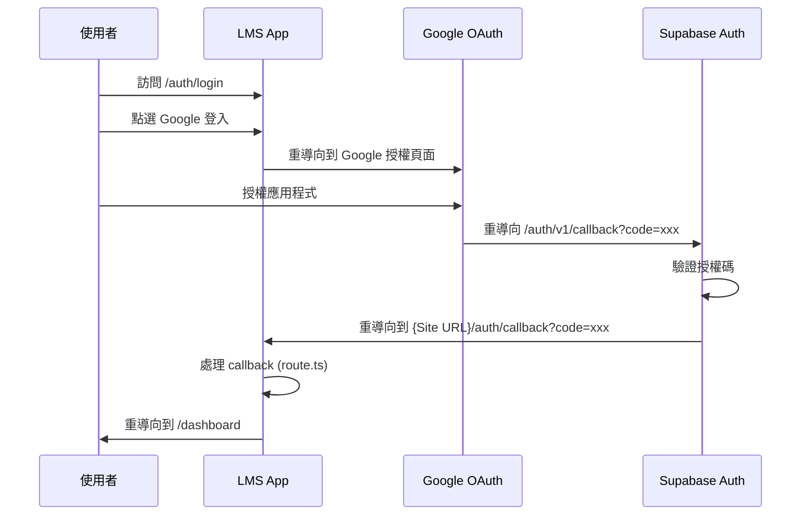

# OAuth 回調 URL 修復指南

> **問題**: Zeabur 生產環境 Google OAuth 登入後重導向到錯誤的網址
> **狀態**: 🔧 待修復
> **日期**: 2025-10-17
> **更新**: 2025-10-17 (新增 port 8080 問題診斷)

---

## 🎯 問題描述

### 症狀 A: 重導向到 localhost:3000
從 Zeabur 部署的生產環境 (`https://lms-app.zeabur.app`) 使用 Google OAuth 登入時：

1. ✅ Google 授權流程成功
2. ❌ 授權完成後重導向到 `http://localhost:3000/?code=xxx`
3. ❌ 而非正確的 `https://lms-app.zeabur.app/auth/callback?code=xxx`

### 症狀 B: 重導向到 localhost:8080（新發現）
從 Zeabur 部署的生產環境 (`https://lms-app.zeabur.app`) 使用 Google OAuth 登入時：

1. ✅ Google 授權流程成功
2. ❌ 授權完成後重導向到 `https://localhost:8080/dashboard`
3. ❌ 而非正確的 `https://lms-app.zeabur.app/dashboard`

**Port 8080 的可能來源**:
- Zeabur 容器內部 port（不應影響外部訪問）
- Supabase Site URL 設定為舊的測試值
- 開發環境測試時的遺留配置

### 根本原因
**Supabase Dashboard 的 Site URL 配置錯誤**

可能的錯誤配置：
```
# 症狀 A:
Site URL: http://localhost:3000  ❌ 開發環境網址

# 症狀 B:
Site URL: http://localhost:8080  ❌ 舊的測試網址
# 或
Site URL: https://localhost:8080  ❌ 錯誤的協議 + port
```

應改為：
```
Site URL: https://lms-app.zeabur.app  ✅ 生產環境網址
```

**為什麼會有 port 8080？**
1. **Zeabur 容器內部 port**: Zeabur 應用容器內可能使用 port 8080
2. **歷史遺留**: 開發測試時可能用過不同 port
3. **配置未同步**: Supabase 配置從未更新為生產網址

---

## 🔧 修復步驟

### 步驟 1: 更新 Supabase Site URL（**核心修復**）

#### 1.1 登入 Supabase Dashboard
1. 前往 https://supabase.com/dashboard
2. 使用您的 Supabase 帳號登入
3. 選擇專案：**piwbooidofbaqklhijup**

#### 1.2 修改 URL Configuration
1. 左側選單 → **Authentication** → **URL Configuration**
2. 找到 **Site URL** 欄位
3. 修改為：
   ```
   https://lms-app.zeabur.app
   ```
4. 找到 **Redirect URLs** 欄位
5. 確保包含以下兩個網址（每行一個）：
   ```
   http://localhost:3000/**
   https://lms-app.zeabur.app/**
   ```

   **重要說明**：
   - ✅ 使用 `/**` 萬用字元允許所有子路徑
   - ✅ 使用 `3000`（Next.js 標準 port），而非 `3001`
   - ✅ Redirect URLs 是白名單機制，不影響實際重導向位置

6. 點選頁面底部的 **Save** 按鈕

#### 1.3 驗證配置
檢查頁面上顯示的 **Callback URL (for OAuth)**：
```
https://piwbooidofbaqklhijup.supabase.co/auth/v1/callback
```

這個是 Supabase Auth 服務的回調端點，用於下一步 Google Cloud Console 設定。

---

### 步驟 2: 更新 Google Cloud Console 授權網址

#### 2.1 登入 Google Cloud Console
1. 前往 https://console.cloud.google.com/
2. 使用您的 Google 帳號登入
3. 選擇專案：**LMS-ESID**（或您建立的專案名稱）

#### 2.2 修改 OAuth 2.0 憑證
1. 左側選單 → **API 和服務** → **憑證**
2. 在「OAuth 2.0 用戶端 ID」清單中
3. 點選您的用戶端 ID（名稱如 `LMS-ESID Web Client`）

#### 2.3 檢查授權的 JavaScript 來源
確認已包含以下兩個網址：
```
http://localhost:3000
https://lms-app.zeabur.app
```

如果缺少，點選 **+ 新增 URI** 並輸入缺少的網址。

#### 2.4 檢查授權的重新導向 URI
**重要**：必須包含 Supabase 的回調端點：
```
https://piwbooidofbaqklhijup.supabase.co/auth/v1/callback
```

**注意**：
- ⚠️ 這是 Supabase Auth 的回調端點
- ⚠️ **不是**您的應用程式網址
- ⚠️ URL 必須完全一致（包含 `https://` 和結尾路徑）

如果缺少，點選 **+ 新增 URI** 並輸入。

#### 2.5 儲存變更
點選頁面底部的 **儲存** 按鈕。

---

## 🧪 測試驗證

### 測試 1: 生產環境
1. 開啟瀏覽器無痕模式
2. 前往 `https://lms-app.zeabur.app/auth/login`
3. 點選「使用 Google 帳號登入」
4. 選擇您的測試帳號（如 `xxx@kcislk.ntpc.edu.tw`）
5. 完成 Google 授權

**預期結果**：
- ✅ 重導向到 `https://lms-app.zeabur.app/auth/callback?code=xxx`
- ✅ 接著自動導向 `/dashboard` 或 `/auth/role-select`
- ✅ 成功登入系統

**錯誤結果**（如仍發生）：
- ❌ 重導向到 `http://localhost:3000/?code=xxx`
- 🔍 檢查 Supabase Site URL 是否正確儲存

### 測試 2: 本地開發環境
1. 確保本地 dev server 運行：`npm run dev`
2. 前往 `http://localhost:3000/auth/login`（或 3001 如果 3000 被佔用）
3. 點選「使用 Google 帳號登入」

**預期結果**：
- ✅ 仍可正常登入（因為 Redirect URLs 白名單包含 localhost）
- ✅ 重導向到 `http://localhost:3000/dashboard`

---

## 📊 配置說明

### Site URL vs Redirect URLs 的區別

| 配置項 | 作用 | 數量限制 | 範例 |
|--------|------|----------|------|
| **Site URL** | OAuth 完成後的**預設重導向基底網址** | **只能 1 個** | `https://lms-app.zeabur.app` |
| **Redirect URLs** | 允許的重導向目標**白名單** | **可多個** | `http://localhost:3000/**`<br>`https://lms-app.zeabur.app/**` |

### OAuth 流程詳解



**關鍵步驟**：
- 步驟 7: Supabase 使用 **Site URL** 作為重導向基底
- 如果 Site URL = `http://localhost:3000`
  - 則重導向到 `http://localhost:3000/auth/callback?code=xxx` ❌
- 如果 Site URL = `https://lms-app.zeabur.app`
  - 則重導向到 `https://lms-app.zeabur.app/auth/callback?code=xxx` ✅

### 為什麼本地開發仍可運作？

雖然 Site URL 設為生產環境網址，本地開發仍可正常運作，因為：

1. **程式碼使用動態 origin**：
   ```typescript
   // app/auth/callback/route.ts
   const origin = requestUrl.origin  // 動態取得當前網域
   return NextResponse.redirect(`${origin}/dashboard`)
   ```

2. **Redirect URLs 白名單包含 localhost**：
   ```
   http://localhost:3000/**  ✅ 允許本地開發
   ```

3. **實際流程**：
   - 本地訪問 `localhost:3000` → `origin` = `http://localhost:3000`
   - 生產訪問 `lms-app.zeabur.app` → `origin` = `https://lms-app.zeabur.app`

---

## ⚠️ 常見問題

### Q1: 為什麼 Redirect URLs 用 3000 不是 3001？

**A**: 因為：
- ✅ `3000` 是 Next.js 標準 port
- ✅ Redirect URLs 是**白名單**，不影響實際重導向位置
- ✅ 目前運行在 3001 是因為 3000 被佔用（臨時狀況）
- ✅ 未來重啟可能 3000 不被佔用，使用標準 port 更穩定

### Q2: 修改後需要重新部署嗎？

**A**: ❌ **不需要**
- Supabase 配置修改後**立即生效**
- Google Cloud Console 修改後**立即生效**
- 無需重新部署程式碼或重啟伺服器

### Q3: 如果仍然重導向到 localhost 怎麼辦？

**A**: 檢查清單：
1. ✅ Supabase Site URL 是否正確儲存為 `https://lms-app.zeabur.app`
2. ✅ 瀏覽器快取是否清除（使用無痕模式測試）
3. ✅ Google Cloud Console 授權網址是否包含正確的 Supabase 回調 URL
4. ✅ 檢查瀏覽器 Console 是否有錯誤訊息

### Q4: 本地開發時如何清理 port 3000 佔用？

**A**: 執行以下命令：
```bash
# 1. 找出佔用 3000 的程序
lsof -i :3000

# 2. 終止該程序（替換 <PID> 為實際 PID）
kill -9 <PID>

# 3. 重新啟動在標準 port 3000
npm run dev
```

---

## 📝 修復檢查清單

在開始修復前，請確認：

- [ ] 您有 Supabase Dashboard 的存取權限
- [ ] 您有 Google Cloud Console 的存取權限
- [ ] 您知道 Supabase 專案 ID：`piwbooidofbaqklhijup`
- [ ] 您知道 Zeabur 部署網址：`https://lms-app.zeabur.app`

修復過程中：

- [ ] Supabase Site URL 已改為 `https://lms-app.zeabur.app`
- [ ] Supabase Redirect URLs 包含 `http://localhost:3000/**`
- [ ] Supabase Redirect URLs 包含 `https://lms-app.zeabur.app/**`
- [ ] Google 授權的 JavaScript 來源包含兩個網址
- [ ] Google 授權的重新導向 URI 包含 Supabase 回調端點
- [ ] 已儲存所有變更

測試驗證：

- [ ] 生產環境測試通過（Zeabur）
- [ ] 本地開發測試通過（localhost）
- [ ] 首次登入流程正常（role-select）
- [ ] 現有使用者登入正常（dashboard）

---

## 📚 相關文件

- [Google OAuth 設定指南](./GOOGLE_OAUTH_SETUP.md)
- [Supabase Cloud 設定指南](../setup/SUPABASE_CLOUD_SETUP.md)
- [OAuth 回調處理器](../../app/auth/callback/route.ts)

---

## 🎯 完成後效果

修復完成後：

✅ **生產環境**：
- 從 `https://lms-app.zeabur.app` 登入 → 成功
- OAuth 流程完全在生產網域內完成
- 無需跳轉到 localhost

✅ **本地開發**：
- 從 `http://localhost:3000` 登入 → 成功
- 開發體驗不受影響
- 可繼續使用 Google OAuth 測試

✅ **多環境支援**：
- 單一配置同時支援生產和開發環境
- 無需在不同環境間切換配置
- Site URL 設為主要環境（生產）
- Redirect URLs 白名單包含所有環境

---

## 🔬 Port 8080 問題特殊診斷步驟

### 如果您遇到的是 port 8080 問題

#### 診斷步驟 1: 確認當前 Supabase Site URL
1. 登入 Supabase Dashboard
2. Authentication → URL Configuration
3. 查看 **Site URL** 欄位的當前值
4. 如果包含 `8080` 或 `localhost:8080`，這就是問題來源

#### 診斷步驟 2: 檢查 OAuth 流程日誌
1. 開啟瀏覽器開發者工具 (F12)
2. 切換到 **Network** 標籤
3. 嘗試 Google 登入
4. 查找 `/auth/v1/callback` 的請求
5. 檢查 **Response Headers** 中的 `Location`
6. 如果 Location 包含 `localhost:8080`，確認是 Supabase Site URL 問題

#### 診斷步驟 3: 驗證 Zeabur 環境變數（預防性）
雖然 Zeabur 環境變數通常不會影響 OAuth 回調，但建議檢查：

1. Zeabur Dashboard → 您的專案 → 服務設定
2. 檢查以下變數：
   ```env
   NEXT_PUBLIC_SUPABASE_URL=https://piwbooidofbaqklhijup.supabase.co
   NEXT_PUBLIC_SITE_URL=https://lms-app.zeabur.app  (可選)
   ```
3. 確認沒有 `PORT=8080` 或類似的錯誤設定

#### 修復驗證
修復後，測試流程應該是：
```
1. 訪問 https://lms-app.zeabur.app/admin
2. Google OAuth 授權
3. 重導向到 https://lms-app.zeabur.app/auth/callback?code=xxx  ✅
4. 自動導向 https://lms-app.zeabur.app/dashboard  ✅
```

**不應該看到任何 `localhost:8080` 的網址！**

### Port 8080 vs Port 3000 的區別

| Port | 可能來源 | 影響 | 修復方式 |
|------|----------|------|----------|
| **3000** | Next.js 預設 port | 本地開發正常，生產環境錯誤 | 修改 Supabase Site URL |
| **8080** | Zeabur 內部 port / 舊測試配置 | 所有環境都錯誤 | 修改 Supabase Site URL |

**兩者的修復方式相同**：將 Supabase Site URL 改為正確的生產網址。

---

**修復預估時間**: 10 分鐘
**技術難度**: 簡單（僅配置修改，無需程式碼變更）
**影響範圍**: OAuth 登入功能，不影響其他功能
